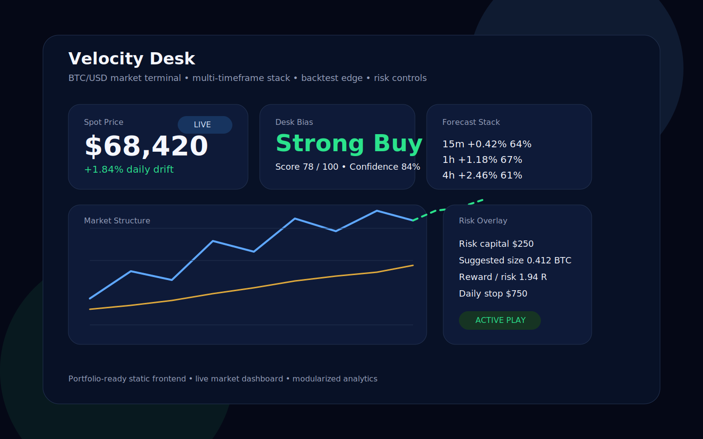
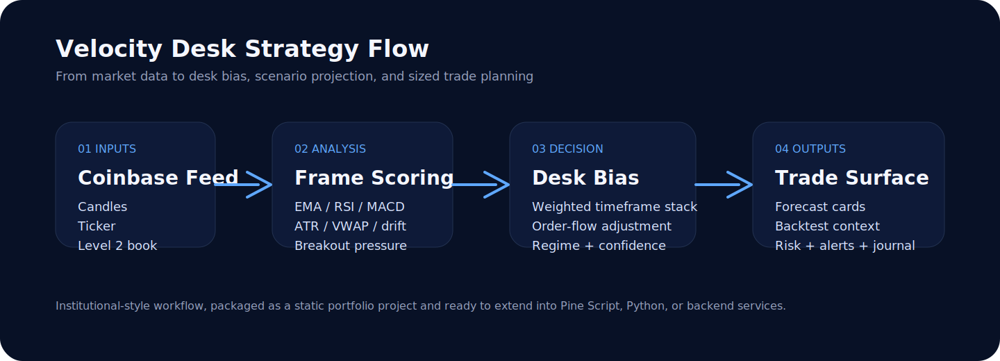

# Velocity Desk

Velocity Desk is a hedge-fund-style Bitcoin trading desk built as a static web app. The current root app is a scratch rebuild focused on reliability first: it opens with seeded BTC data immediately, then upgrades to live Coinbase polling and optional WebSocket tape when the browser can reach the market feed.



## Hedge-Fund Style Project Description

Velocity Desk is designed to feel closer to an internal crypto desk monitor than a retail price widget. It packages a discretionary BTC/USD workflow into a browser-native terminal:

- live BTC/USD price, spread, volume, and feed state
- multi-timeframe bias across 5m, 15m, 1h, and 4h structure
- trader-style buy, hold, and sell scoring
- order-flow reads from bid/ask imbalance, delta, spread, and tape speed
- scenario forecasts for 15m, 1h, and 4h horizons
- rolling backtest context for current signal quality
- risk sizing, stop distance, reward/risk, and daily lockout logic
- alert thresholds, browser notifications, optional webhook relay, and journal tracking

The goal is not to pretend this is a production execution engine. The goal is to present a coherent, portfolio-ready discretionary trading tool that looks intentional on GitHub and still works in a plain browser environment.

## Current Build

The active app is the root [index.html](./index.html).

It is intentionally:

- single-file
- static-host friendly
- seeded-first so the UI is never blank on load
- browser-only with no required custom backend

This was done to avoid fragile browser/module/runtime issues and make the project easier to review, run, and publish.

## Strategy Snapshot



Velocity Desk follows a five-step trader workflow:

1. Start from a seeded BTC tape so the desk is always visible.
2. Pull live Coinbase ticker, stats, book, and candles when available.
3. Score BTC structure across multiple timeframes using EMA trend, RSI, MACD, ATR, and order-flow context.
4. Convert that signal into trader-readable forecasts, backtest context, and a playbook.
5. Wrap the setup with position sizing, journal tracking, and alerts.

Full details:

- [Strategy explanation](./docs/STRATEGY.md)
- [Architecture overview](./docs/ARCHITECTURE.md)

## Repo Structure

```text
.
├── assets/
│   ├── strategy-flow.svg
│   └── velocity-desk-preview.svg
├── docs/
│   ├── ARCHITECTURE.md
│   └── STRATEGY.md
├── src/
│   ├── js/
│   └── main.js
├── index.html
├── LICENSE
├── package.json
└── README.md
```

### Structure Notes

- `index.html` is the active app and contains the current scratch rebuild.
- `docs/` holds the GitHub-facing strategy and architecture explanations.
- `assets/` holds visual assets for the repository page.
- `src/` is retained as a legacy modular reference from the earlier productionization pass. The current root build does not depend on it.

## Quick Start

### Option 1: Run the local static server

```bash
npm run dev
```

Then open [http://localhost:4173](http://localhost:4173).

### Option 2: Use Python directly

```bash
python3 -m http.server 4173
```

### Option 3: Deploy as a static site

The project can be deployed directly to:

- GitHub Pages
- Vercel
- Netlify
- Cloudflare Pages
- any basic static host

## Usage Examples

### Intraday continuation read

- Wait for `Buy` or `Strong Buy` on the combined desk bias.
- Confirm that 1h and 4h are not fighting the move.
- Use the playbook entry, stop, and target together with the risk lab size.

### Defensive fade setup

- Watch for `Sell` or `Strong Sell` with weak short-term order flow.
- Use the one-hour and four-hour forecast cards to judge whether the move has room.
- Keep size tied to the configured risk budget instead of discretionary notional.

### Alert workflow

- Set `Buy Below` and `Sell Above` thresholds.
- Turn on browser notifications if you want desktop alerts.
- Add a webhook URL if you want the browser to queue external relay messages.

## Why The Scratch Rebuild Exists

The earlier version of the repo used a modular browser runtime under `src/`. That structure is still useful as reference code, but the active root app was rebuilt into one file for practical reasons:

- fewer browser compatibility problems
- easier GitHub review
- simpler static deployment
- seeded fallback data directly in the page
- no dependency on module resolution to show the core desk

For a portfolio project, that tradeoff is worth it.

## Limitations

- Signals and forecasts are heuristic trader tools, not investment advice.
- Backtests are simplified and do not model fees, slippage, or full regime segmentation.
- Coinbase-only market access means this is not a cross-exchange institutional data stack.
- Webhook delivery is browser-queued, not server-guaranteed.

## GitHub Notes

Repository: [Pickyvicky26/Build-Bitcoin-trading-tracker](https://github.com/Pickyvicky26/Build-Bitcoin-trading-tracker)

This repo is set up to read well on GitHub:

- clear project framing
- explicit setup instructions
- strategy and architecture notes
- visual assets for profile/portfolio presentation
- static deployment path with minimal friction
